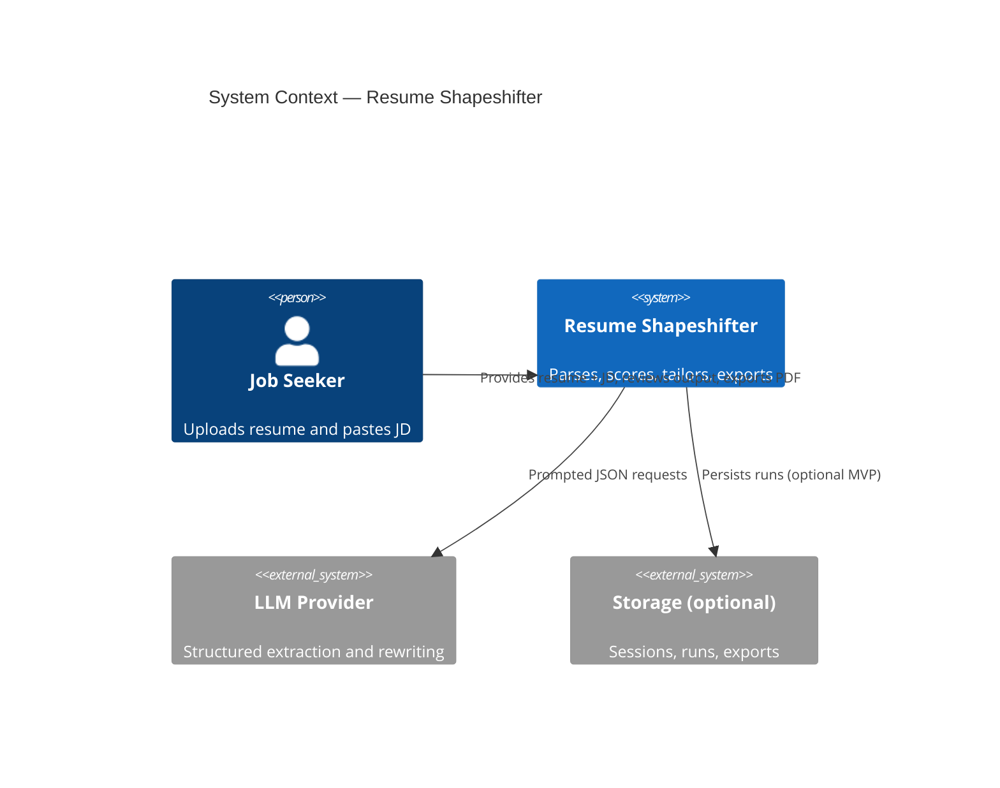
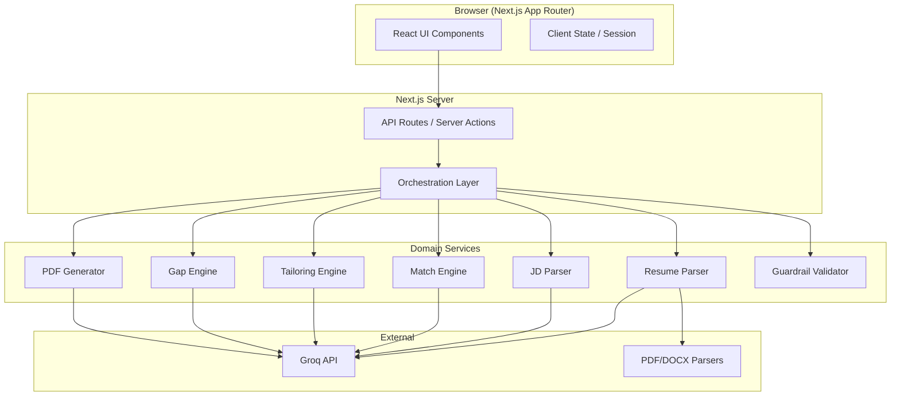
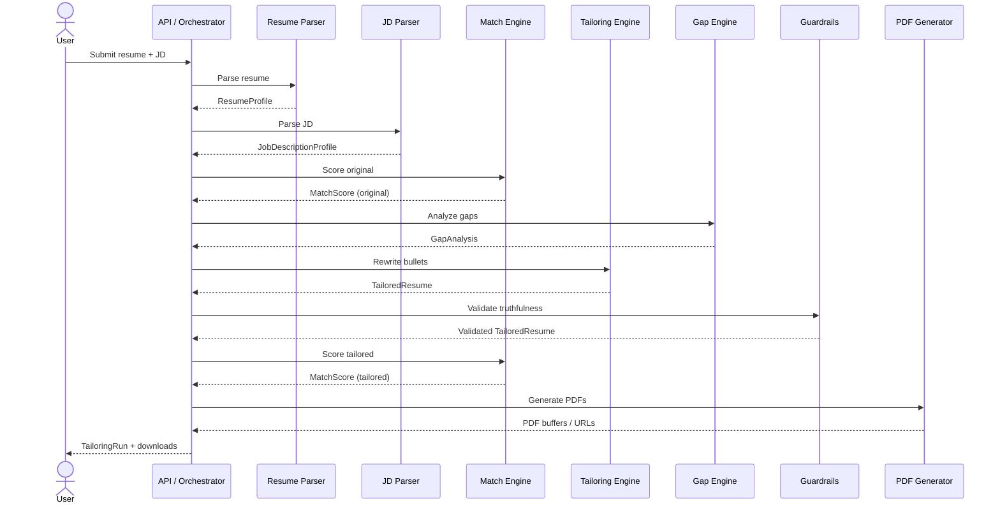
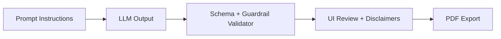
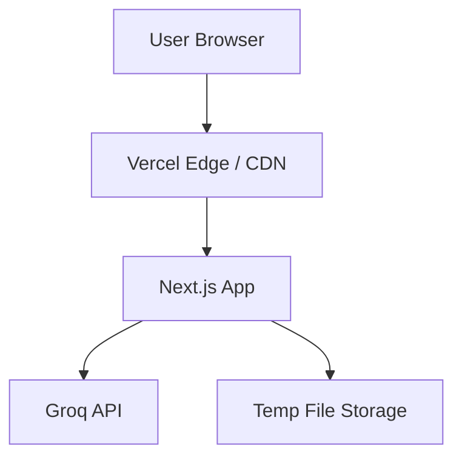

# Resume Shapeshifter — Architecture

This document describes the technical architecture for **Resume Shapeshifter**, a JD-to-resume tailoring engine that rewrites resume bullets truthfully, scores resume-to-JD alignment, flags gaps, and exports a side-by-side proof PDF.

It is derived from the product requirements in [`problem_statement.md`](./problem_statement.md).

---

## Table of Contents

1. [Architecture Principles](#1-architecture-principles)
2. [System Context](#2-system-context)
3. [High-Level Architecture](#3-high-level-architecture)
4. [Core Pipeline](#4-core-pipeline)
5. [Component Design](#5-component-design)
6. [Data Models & Schemas](#6-data-models--schemas)
7. [API Design](#7-api-design)
8. [LLM Architecture](#8-llm-architecture)
9. [Truthfulness & Guardrails](#9-truthfulness--guardrails)
10. [Frontend Architecture](#10-frontend-architecture)
11. [PDF Generation](#11-pdf-generation)
12. [Storage Strategy](#12-storage-strategy)
13. [Cross-Cutting Concerns](#13-cross-cutting-concerns)
14. [Deployment Topology](#14-deployment-topology)
15. [Implementation Phases](#15-implementation-phases)
16. [Risks & Mitigations](#16-risks--mitigations)
17. [Suggested Repository Layout](#17-suggested-repository-layout)

---

## 1. Architecture Principles

| Principle | Rationale |
|-----------|-----------|
| **Vertical slice first** | Ship a working end-to-end flow (paste → analyze → tailor → export) before polishing peripheral features. |
| **Structured outputs everywhere** | Every engine returns validated JSON via Zod schemas; LLM responses are never trusted without schema validation. |
| **Truthfulness by design** | Fabrication prevention is enforced in prompts, post-processing validators, and UI review—not as an afterthought. |
| **Explainability over opacity** | Scores, rewrites, and gaps must include human-readable evidence and reasons. |
| **Separation of concerns** | Parsing, scoring, tailoring, gap analysis, and rendering are independent modules with clear contracts. |
| **Server-side secrets** | API keys and document processing run on the server; the client never holds LLM credentials. |
| **MVP simplicity** | Session/local storage is acceptable for v1; persistence layers are optional extensions behind interfaces. |

---

## 2. System Context

Resume Shapeshifter sits between a job seeker and two unstructured inputs (resume + job description), producing structured analysis, a tailored resume, and exportable proof artifacts.



### Actors

- **Primary:** Job seekers tailoring resumes for specific roles.
- **Secondary:** Career coaches and reviewers using the side-by-side PDF as a review artifact.

### External Dependencies

- **Groq API** for LLM inference, using Groq's OpenAI-compatible Chat Completions endpoint and JSON schema structured outputs where supported.
- **Document parsers** (`pdf-parse`, `mammoth` for DOCX; plain text is native).
- **PDF renderer** (Playwright, Puppeteer, or `@react-pdf/renderer`).

---

## 3. High-Level Architecture

The system follows a **modular monolith** pattern: a Next.js full-stack application with API routes orchestrating discrete domain services. A separate Python FastAPI service is an optional extension if document parsing quality demands it; the default path keeps everything in TypeScript for Cursor-friendly iteration.



### Layer Responsibilities

| Layer | Responsibility |
|-------|----------------|
| **Presentation** | Input forms, score cards, side-by-side diff, export controls, loading/error states. |
| **API / Orchestration** | Authenticates requests (future), sequences pipeline steps, aggregates `TailoringRun` results. |
| **Domain Services** | Stateless engines with typed inputs/outputs; unit-testable without UI. |
| **Infrastructure** | LLM client, file upload handling, PDF rendering, optional database adapters. |

---

## 4. Core Pipeline

A single **Tailoring Run** is the atomic unit of work. It progresses through deterministic stages with well-defined artifacts at each step.



### Pipeline Stages

| Stage | Input | Output | Notes |
|-------|-------|--------|-------|
| **1. Ingest** | Raw resume (text/PDF/DOCX), raw JD text | Normalized plain text | File upload → text extraction |
| **2. Parse Resume** | Plain text resume | `ResumeProfile` | LLM cleanup + rule-based section detection |
| **3. Parse JD** | Plain text JD | `JobDescriptionProfile` | LLM extraction of skills, responsibilities, seniority |
| **4. Score (original)** | `ResumeProfile` + `JobDescriptionProfile` | `MatchScore` | Baseline before tailoring |
| **5. Gap Analysis** | `ResumeProfile` + `JobDescriptionProfile` | `GapAnalysis` | Missing/weak requirements with suggested actions |
| **6. Tailor** | `ResumeProfile` + `JobDescriptionProfile` + `GapAnalysis` | `TailoredResume` | Bullet-level rewrites with metadata |
| **7. Guardrails** | `ResumeProfile` + `TailoredResume` | `TailoredResume` (validated) | Strip/flag unsupported claims |
| **8. Score (tailored)** | Assembled tailored content + JD | `MatchScore` | Post-tailoring improvement metric |
| **9. Export** | Full `TailoringRun` | PDF files | Tailored resume + side-by-side comparison |

Stages 4–6 can be partially parallelized after parsing (e.g., original score and gap analysis concurrently), but tailoring depends on gap output for prioritization.

---

## 5. Component Design

### 5.1 Resume Parser Service

**Purpose:** Convert unstructured resume input into canonical `ResumeProfile` JSON.

**Strategies (layered):**

1. **Format extraction**
   - Plain text: pass-through.
   - PDF: `pdf-parse` (watch for column-order issues).
   - DOCX: `mammoth` → HTML/text.

2. **Section segmentation**
   - Heuristic headers (`Experience`, `Education`, `Skills`, etc.).
   - Fallback: LLM `resume-parser` prompt for cleanup and structure.

3. **Normalization**
   - Trim bullets, dedupe skills, standardize date formats.
   - Preserve original raw text for diff/PDF left column.

**Interface:**

```typescript
interface ResumeParserService {
  parse(input: ResumeInput): Promise<ResumeProfile>;
}

type ResumeInput =
  | { type: "text"; content: string }
  | { type: "pdf"; buffer: Buffer }
  | { type: "docx"; buffer: Buffer };
```

### 5.2 JD Parser Service

**Purpose:** Extract structured requirements from pasted job description text.

**Extracted fields:** job title, company, required/preferred skills, tools, responsibilities, qualifications, seniority, domain keywords, soft-skill signals.

**Interface:**

```typescript
interface JDParserService {
  parse(jdText: string): Promise<JobDescriptionProfile>;
}
```

Uses a dedicated LLM prompt with strict JSON schema. No web scraping in MVP.

### 5.3 Match Engine

**Purpose:** Produce an explainable 0–100 match score with sub-scores.

**Scoring dimensions:**

| Dimension | Weight (suggested) | Method |
|-----------|-------------------|--------|
| Required skill coverage | 35% | Set overlap + semantic match via LLM or embeddings |
| Preferred skill coverage | 15% | Same as above, lower weight |
| Responsibility alignment | 20% | Bullet-to-responsibility mapping |
| Keyword alignment | 15% | JD keywords found in resume |
| Seniority alignment | 10% | Title/years vs JD seniority signals |
| Critical missing penalties | −5 to −20 each | Hard requirements absent from resume |

**Interface:**

```typescript
interface MatchEngine {
  score(
    resume: ResumeProfile | TailoredResume,
    jd: JobDescriptionProfile
  ): Promise<MatchScore>;
}
```

Hybrid approach recommended: deterministic keyword/skill overlap for transparency, LLM for responsibility alignment and explanation text.

### 5.4 Tailoring Engine

**Purpose:** Rewrite resume content to better align with the JD without fabricating experience.

**Scope in MVP:**

- Experience bullets (primary).
- Summary paragraph.
- Skills ordering/emphasis.
- Project bullet emphasis (if present).

**Does not change:** employers, dates, degrees, certifications (structure preserved; wording may adjust only where truthful).

**Per-bullet output metadata:**

- `original`, `tailored`, `changeReason`, `keywordsAddressed`, `confidence`, `riskFlag`.

**Interface:**

```typescript
interface TailoringEngine {
  tailor(
    resume: ResumeProfile,
    jd: JobDescriptionProfile,
    gaps: GapAnalysis
  ): Promise<TailoredResume>;
}
```

### 5.5 Gap Engine

**Purpose:** Identify missing or weakly represented JD requirements and recommend honest actions.

**Gap types:**

- Missing required skill.
- Weakly represented skill (mentioned but not demonstrated).
- Missing tool/technology.
- Missing domain experience.
- Seniority mismatch.
- Unsupported requirement (must not be invented).

**Interface:**

```typescript
interface GapEngine {
  analyze(
    resume: ResumeProfile,
    jd: JobDescriptionProfile
  ): Promise<GapAnalysis>;
}
```

### 5.6 Guardrail Validator

**Purpose:** Post-process LLM tailoring output before presentation or export.

**Checks:**

- New employers, degrees, or certifications not in source resume → reject or flag.
- New metrics not traceable to original bullets → flag `riskFlag`.
- Expertise claims without resume evidence → downgrade confidence or remove.
- Keyword density spike → warn on keyword stuffing.

Runs after tailoring, before tailored scoring and PDF generation.

### 5.7 PDF Generator

**Purpose:** Produce the two MVP export artifacts.

1. **Tailored Resume PDF** — clean, ATS-friendly single-column layout.
2. **Side-by-Side Comparison PDF** — proof artifact with scores, JD summary, highlighted diffs, gap summary, disclaimer.

See [§11 PDF Generation](#11-pdf-generation).

### 5.8 Orchestrator

**Purpose:** Single entry point coordinating the pipeline and persisting a `TailoringRun`.

```typescript
interface TailoringOrchestrator {
  run(input: TailoringRunInput): Promise<TailoringRun>;
}
```

Handles retries on LLM JSON parse failures (bounded, e.g., 2 retries with repair prompt), aggregates errors, and exposes partial results when a non-critical stage fails.

---

## 6. Data Models & Schemas

All domain types are defined once in `lib/schemas.ts` (Zod) and inferred to TypeScript types.

### 6.1 Core Entities

```typescript
// Conceptual — implement with Zod

ResumeProfile {
  contact: ContactInfo
  summary: string
  skills: string[]
  experience: ExperienceEntry[]
  projects: ProjectEntry[]
  education: EducationEntry[]
  certifications: CertificationEntry[]
  rawText?: string  // preserved for PDF left column
}

JobDescriptionProfile {
  jobTitle: string
  company: string
  requiredSkills: string[]
  preferredSkills: string[]
  responsibilities: string[]
  qualifications: string[]
  tools: string[]
  keywords: string[]
  seniorityLevel: string
  domainSignals: string[]
}

MatchScore {
  overallScore: number          // 0-100
  skillCoverageScore: number
  responsibilityAlignmentScore: number
  keywordScore: number
  seniorityScore: number
  criticalMissingRequirements: string[]
  explanation: string
}

TailoredBullet {
  original: string
  tailored: string
  changeReason: string
  keywordsAddressed: string[]
  confidence: "high" | "medium" | "low"
  riskFlag: string | null
}

TailoredResume {
  tailoredSummary: string
  tailoredSkills: string[]
  tailoredExperience: TailoredExperienceEntry[]
  tailoredProjects?: TailoredProjectEntry[]
}

Gap {
  name: string
  importance: "high" | "medium" | "low"
  jdEvidence: string
  resumeEvidence: string
  suggestedAction: string
  canSafelyAdd: boolean
}

GapAnalysis {
  gaps: Gap[]
}

TailoringRun {
  id: string
  createdAt: string
  resume: ResumeProfile
  jobDescription: JobDescriptionProfile
  originalScore: MatchScore
  tailoredScore: MatchScore
  gaps: GapAnalysis
  tailored: TailoredResume
  status: "pending" | "complete" | "failed"
  exportUrls?: { tailoredPdf?: string; comparisonPdf?: string }
}
```

### 6.2 Persistence Entities (Optional)

When adding a database:

| Entity | Key Fields |
|--------|------------|
| `User` | id, email (future auth) |
| `Resume` | id, userId, profile JSON, createdAt |
| `JobDescription` | id, userId, profile JSON, rawText |
| `TailoringRun` | id, resumeId, jdId, scores, outputs |
| `ExportedDocument` | id, runId, type, storagePath |

---

## 7. API Design

REST-style Next.js Route Handlers under `/app/api/`.

### Endpoints (MVP)

| Method | Path | Description |
|--------|------|-------------|
| `POST` | `/api/parse/resume` | Upload or text → `ResumeProfile` |
| `POST` | `/api/parse/jd` | JD text → `JobDescriptionProfile` |
| `POST` | `/api/analyze` | Resume + JD → original score + gaps (no tailoring) |
| `POST` | `/api/tailor` | Full pipeline → `TailoringRun` |
| `GET` | `/api/runs/:id` | Retrieve run (if persisted) |
| `POST` | `/api/export/pdf` | `TailoringRun` id or body → PDF binary |

### Example: Full Tailor Request

```http
POST /api/tailor
Content-Type: application/json

{
  "resume": { "type": "text", "content": "..." },
  "jobDescription": "..."
}
```

### Example: Response Shape

```json
{
  "run": {
    "id": "run_abc123",
    "status": "complete",
    "originalScore": { "overallScore": 62, "explanation": "..." },
    "tailoredScore": { "overallScore": 78, "explanation": "..." },
    "gaps": { "gaps": [] },
    "tailored": { "tailoredExperience": [] }
  }
}
```

### Error Contract

```json
{
  "error": {
    "code": "LLM_PARSE_ERROR | VALIDATION_ERROR | PARSE_ERROR",
    "message": "Human-readable message",
    "details": {}
  }
}
```

---

## 8. LLM Architecture

The MVP LLM provider is **Groq**, not OpenAI. Keep the `LLMClient` abstraction provider-neutral enough for future swaps, but implement and test the first concrete client against Groq from Phase 2 onward so model selection, structured output behavior, retry handling, and rate-limit behavior match the real deployment target.

### 8.1 Prompt Modules

Each prompt lives in an isolated file under `prompts/`:

| File | Purpose |
|------|---------|
| `jd-extraction.ts` | JD → `JobDescriptionProfile` |
| `resume-parser.ts` | Messy text → `ResumeProfile` cleanup |
| `match-scoring.ts` | Pair → `MatchScore` + explanation |
| `bullet-rewriter.ts` | Bullets → `TailoredResume` experience entries |
| `gap-analysis.ts` | Pair → `GapAnalysis` |
| `resume-assembly.ts` | Final summary/skills polish (optional pass) |

### 8.2 LLM Client Abstraction

```typescript
interface LLMClient {
  completeJSON<T>(params: {
    system: string;
    user: string;
    schema: ZodSchema<T>;
    temperature?: number;
  }): Promise<T>;
}
```

- Use provider **structured outputs** or JSON mode where available.
- Always validate with Zod after response.
- On validation failure: retry once with “fix JSON to match schema” repair prompt.

### 8.3 Groq Provider Requirements

- Use Groq Chat Completions through `groq-sdk` or the OpenAI-compatible endpoint at `https://api.groq.com/openai/v1`.
- Configure `GROQ_API_KEY` and optional `GROQ_MODEL`; default the MVP to `llama-3.3-70b-versatile` unless testing shows a better latency/quality tradeoff.
- Prefer Groq `response_format` JSON schema structured outputs for extraction, scoring, gap analysis, and tailoring prompts where the selected model supports it.
- Keep Zod as the final contract validator even when strict structured outputs are enabled.
- Fall back to JSON-only prompt instructions plus a bounded repair retry when strict schemas are unavailable.
- Do not send unsupported OpenAI request fields: `logprobs`, `logit_bias`, `top_logprobs`, `messages[].name`, or `n` values other than `1`.
- Use low positive temperatures such as `0.1` for deterministic extraction instead of relying on exact zero.

### 8.4 Prompt Rules (Global System Instructions)

Embedded in every tailoring-related prompt:

- Never invent employers, degrees, certifications, or metrics.
- Use only evidence from the provided resume.
- Mark uncertain suggestions with low confidence.
- Keep bullets concise (1–2 lines).
- Prefer measurable impact when present in source.
- Avoid keyword stuffing.
- Preserve career level and seniority.
- Explain every meaningful rewrite.

### 8.5 Token & Cost Strategy

- Send **structured resume/JD JSON** to downstream prompts, not raw text repeatedly.
- Rewrite bullets in batches per job entry (not one LLM call per bullet) to reduce round-trips.
- Cache parsed `ResumeProfile` and `JobDescriptionProfile` within a run.
- Capture Groq token usage, model id, latency, and retry count per stage for cost and reliability tuning without logging resume/JD contents.

---

## 9. Truthfulness & Guardrails

Truthfulness is enforced in three layers:



### Layer 1 — Prompts

Explicit negative constraints: no fabricated history, no unsupported metrics, no expert claims without evidence.

### Layer 2 — Programmatic Validation

| Rule | Action |
|------|--------|
| New company name in tailored experience | Block export; require user edit |
| New degree/certification | Block |
| New numeric metric not in original | Set `riskFlag`; require confirmation |
| Technology in bullet but not in resume or gaps | Flag or remove |
| Confidence = low | Show prominent UI warning |

### Layer 3 — User Review

- Side-by-side diff with per-bullet `changeReason`.
- Export gated behind “I have reviewed and verify accuracy” checkbox.
- PDF footer disclaimer on every export.

---

## 10. Frontend Architecture

### 10.1 Tech Stack

- **Framework:** Next.js 14+ (App Router), React, TypeScript
- **Styling:** Tailwind CSS, Shadcn UI
- **Validation:** Zod (shared with server)
- **State:** React state + URL/search params for step; optional `zustand` if complexity grows

### 10.2 Routes / Screens

| Route | Purpose |
|-------|---------|
| `/` | Landing — value prop, CTA, sample demo link |
| `/tailor` | Combined input: resume upload/paste + JD paste |
| `/tailor/analyze` | JD summary, requirements, original score, initial gaps |
| `/tailor/results` | Side-by-side bullets, tailored score, gap panel |
| `/tailor/export` | PDF download, optional MD/DOCX (later) |

MVP may collapse these into a **single-page wizard** with step indicators.

### 10.3 Key Components

| Component | Responsibility |
|-----------|----------------|
| `ResumeInput` | Text area + file drop (PDF/DOCX) |
| `JDInput` | JD text area |
| `ScoreCard` | Overall + sub-scores, before/after |
| `JDRequirementsSummary` | Extracted skills, responsibilities |
| `GapAnalysisPanel` | Sortable gaps with suggested actions |
| `SideBySideDiff` | Original vs tailored bullets with metadata |
| `BulletChangeCard` | Single bullet with reason, keywords, risk |
| `PDFExportButton` | Triggers export, shows disclaimer modal |
| `LoadingPipeline` | Stage progress (parse → score → tailor → export) |

### 10.4 Client-Server Boundary

- Heavy processing stays on server (`/api/tailor`).
- Client holds `TailoringRun` in memory (or sessionStorage) between steps.
- File uploads use `multipart/form-data` to `/api/parse/resume`.

---

## 11. PDF Generation

### 11.1 Recommended Approach

**Option A (recommended for comparison PDF):** HTML template + **Playwright** `page.pdf()`

- Full CSS control for two-column layout and highlights.
- Server renders a dedicated `/export/comparison/[runId]` print view.

**Option B:** `@react-pdf/renderer` for programmatic PDF (better for simple tailored resume; weaker for complex diffs).

**MVP recommendation:** Playwright for comparison PDF; React-PDF or same Playwright flow for tailored-only PDF.

### 11.2 Side-by-Side Comparison PDF Contents

1. Header: job title, company, date
2. Score strip: original vs tailored (numeric + one-line explanation each)
3. JD requirements summary (top skills, responsibilities)
4. Two-column body:
   - Left: original bullets (unchanged sections gray)
   - Right: tailored bullets (changed lines highlighted)
5. Gap analysis table (name, importance, suggested action)
6. Footer: truthfulness disclaimer

### 11.3 Highlight Strategy

- Diff at bullet granularity: compare `original` vs `tailored` strings.
- Use background color (#FEF3C7) for changed tailored lines.
- Include inline `changeReason` in appendix or margin notes if space allows.

---

## 12. Storage Strategy

### MVP (Default)

| Data | Storage |
|------|---------|
| Current session inputs | `sessionStorage` / in-memory React state |
| `TailoringRun` results | In-memory until export; optional `sessionStorage` |
| Generated PDFs | Ephemeral server temp files or direct stream to client |
| API keys | Server environment variables only |

### Optional Persistence

| Option | Use Case |
|--------|----------|
| **SQLite** | Local prototype, single-user history |
| **Supabase / PostgreSQL** | Multi-user, saved runs, auth |
| **Object storage (S3)** | Long-lived PDF artifacts |

Use a `StorageAdapter` interface so MVP runs without a database:

```typescript
interface RunRepository {
  save(run: TailoringRun): Promise<void>;
  findById(id: string): Promise<TailoringRun | null>;
}
```

---

## 13. Cross-Cutting Concerns

### 13.1 Observability

- Structured logging per pipeline stage with `runId` correlation.
- Log LLM latency and token usage (no PII in logs).
- User-facing error messages generic; details in server logs.

### 13.2 Security

- Rate limit `/api/tailor` (e.g., per IP) to control LLM cost.
- Validate file upload size and MIME type.
- Sanitize text before embedding in HTML/PDF templates.
- Never log full resume content in production.

### 13.3 Performance

| Stage | Target (MVP) |
|-------|----------------|
| Resume parse (text) | < 2s |
| JD parse | < 5s |
| Full tailor pipeline | < 30s |
| PDF generation | < 10s |

Show streaming progress UI; consider SSE for stage updates on slow runs.

### 13.4 Testing Strategy

| Layer | Focus |
|-------|-------|
| Unit | Zod schemas, scoring weights, guardrail rules, diff logic |
| Integration | Mocked LLM client returning fixture JSON |
| E2E | Paste sample resume + real JD → assert scores and PDF download |
| Golden files | Snapshot comparison PDFs for regression |

---

## 14. Deployment Topology



### MVP Deployment

- **Vercel** for Next.js (API routes + static UI).
- Environment: `GROQ_API_KEY`, optional `GROQ_MODEL`, optional `DATABASE_URL`.
- Playwright on Vercel may require `@sparticuz/chromium` for serverless PDF.

### Alternative

- Next.js frontend on Vercel + **FastAPI** sidecar on Railway/Fly.io for Python-heavy parsing if needed.

---

## 15. Implementation Phases

Aligned with the product plan in `problem_statement.md`:

| Phase | Deliverables |
|-------|----------------|
| **1 — Static prototype** | Input UI, mocked `TailoringRun`, in-browser side-by-side |
| **2 — LLM integration** | All prompts, Zod validation, real parse/score/tailor/gap |
| **3 — PDF export** | Tailored + comparison PDFs with highlights |
| **4 — Guardrails** | Validator, confidence labels, export confirmation |
| **5 — Polish** | Samples, loading states, error handling, demo script |

**First vertical slice:** single page, pasted text only, one `/api/tailor` call, side-by-side preview, comparison PDF download.

---

## 16. Risks & Mitigations

| Risk | Impact | Mitigation |
|------|--------|------------|
| PDF multi-column parse errors | Garbled `ResumeProfile` | Text paste fallback; show parse preview for user correction |
| LLM fabricates experience | Trust/safety failure | Prompts + guardrails + risk flags + export disclaimer |
| Inconsistent LLM JSON | Pipeline failures | Zod validation, retry with repair prompt, fallback error UI |
| Scores feel falsely precise | User mistrust | Show sub-scores, evidence lists, “estimate” language |
| Long pipeline latency | Poor UX | Stage progress, parallel gap + original score |
| Keyword stuffing in tailoring | Unnatural output | Density check in guardrails; prompt anti-stuffing rules |
| Serverless PDF limits | Export failures | Chromium bundle; alternative react-pdf for v1 |

---

## 17. Suggested Repository Layout

```text
resume-shapeshifter/
├── app/
│   ├── page.tsx                    # Landing
│   ├── tailor/
│   │   └── page.tsx                # Main wizard
│   ├── export/
│   │   └── comparison/[runId]/     # Print-friendly PDF view
│   └── api/
│       ├── parse/resume/route.ts
│       ├── parse/jd/route.ts
│       ├── analyze/route.ts
│       ├── tailor/route.ts
│       └── export/pdf/route.ts
├── components/
│   ├── ResumeInput.tsx
│   ├── JDInput.tsx
│   ├── ScoreCard.tsx
│   ├── GapAnalysisPanel.tsx
│   ├── SideBySideDiff.tsx
│   └── PDFExportButton.tsx
├── lib/
│   ├── schemas.ts                  # Zod schemas + inferred types
│   ├── orchestrator.ts
│   ├── llm/client.ts
│   ├── services/
│   │   ├── resume-parser.ts
│   │   ├── jd-parser.ts
│   │   ├── match-engine.ts
│   │   ├── tailoring-engine.ts
│   │   ├── gap-engine.ts
│   │   └── guardrails.ts
│   ├── pdf/
│   │   ├── comparison-template.tsx
│   │   └── generate.ts
│   └── storage/
│       └── run-repository.ts
├── prompts/
│   ├── jd-extraction.ts
│   ├── resume-parser.ts
│   ├── match-scoring.ts
│   ├── bullet-rewriter.ts
│   └── gap-analysis.ts
├── fixtures/
│   ├── sample-resume.txt
│   └── sample-jd.txt
├── architecture.md
├── problem_statement.md
└── package.json
```

---

## Appendix: Definition of Done (Technical)

The architecture is successfully realized when:

1. A user can paste resume + JD and trigger a full `TailoringRun` via API.
2. All engine outputs validate against Zod schemas.
3. Original and tailored match scores are computed with explanations.
4. Every rewritten bullet includes reason, keywords, confidence, and optional risk flag.
5. Gap analysis lists actionable items with importance and evidence.
6. Guardrails block or flag unsupported claims before export.
7. Two PDFs are generated: tailored resume and side-by-side comparison with scores, gaps, and disclaimer.
8. A demo with a real job listing produces a portfolio-ready proof artifact.

---

*Resume Shapeshifter turns any job description into a truthful, targeted resume rewrite with match scoring, gap analysis, and a side-by-side PDF proof artifact.*
