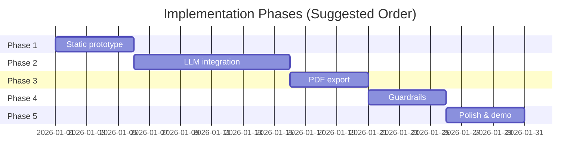
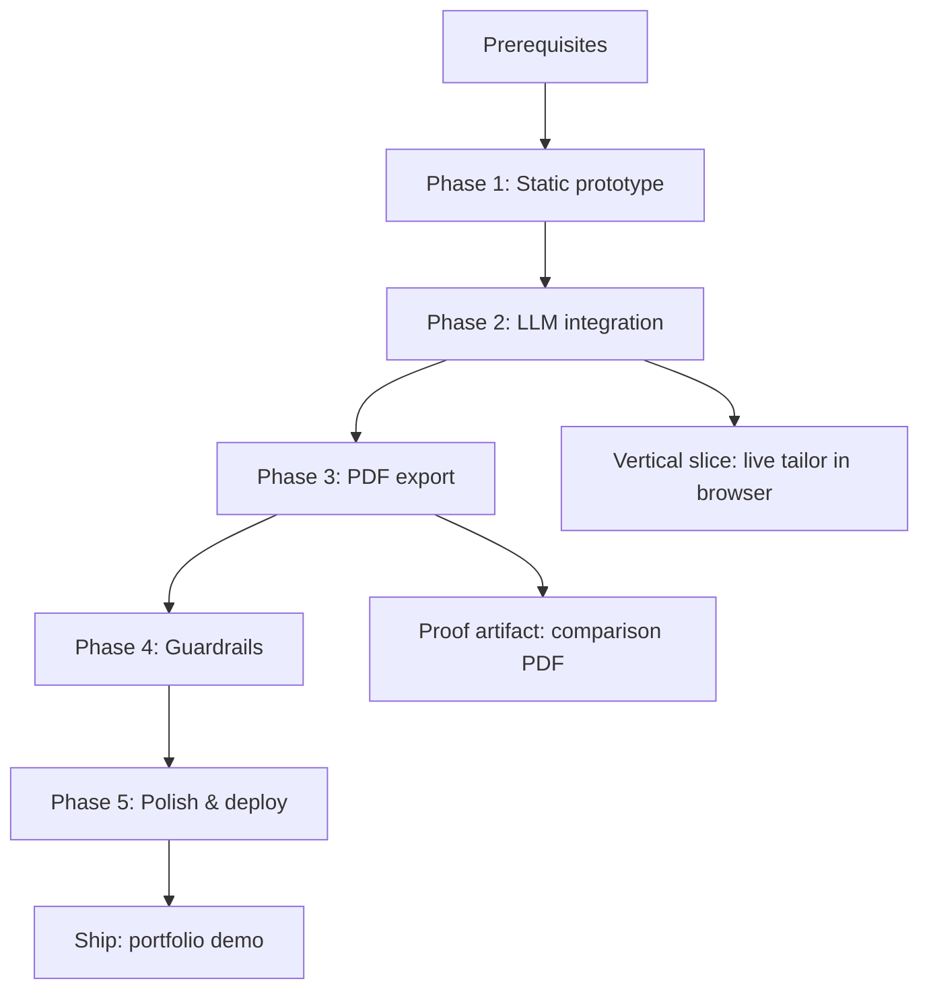

# Resume Shapeshifter — Phase-Wise Implementation Plan

This document is the execution plan for building Resume Shapeshifter. It expands the five phases defined in [`architecture.md`](./architecture.md) into concrete tasks, file deliverables, dependencies, acceptance criteria, and exit gates.

**North star:** A user can paste a resume and a real job description, run a full tailoring pipeline, review a side-by-side diff with scores and gap analysis, and export a comparison PDF — without fabricated experience.

---

## Overview



| Phase | Name | Primary outcome |
|-------|------|-----------------|
| **1** | Static prototype | Clickable UI with mocked `TailoringRun` and in-browser side-by-side |
| **2** | LLM integration | Real parse, score, gap, and tailor pipeline via `/api/tailor` |
| **3** | PDF export | Tailored resume PDF + side-by-side comparison PDF |
| **4** | Guardrails | Truthfulness validation, risk flags, export confirmation |
| **5** | Polish & demo | Production-ready UX, fixtures, demo script, deploy |

**Recommended first vertical slice (end of Phase 2):** Single page, pasted text only, one `/api/tailor` call, side-by-side preview. PDF and guardrails follow in Phases 3–4.

---

## Prerequisites (Before Phase 1)

Complete these once before writing feature code.

| Task | Details |
|------|---------|
| Initialize repo | `create-next-app` with TypeScript, App Router, Tailwind, ESLint |
| Add Shadcn UI | `npx shadcn@latest init`; add Button, Card, Textarea, Tabs, Badge, Progress |
| Add core deps | `zod`, `uuid` (or `nanoid`) |
| Env scaffold | `.env.example` with `GROQ_API_KEY` and optional `GROQ_MODEL` (used from Phase 2) |
| Folder skeleton | Match [§17 in architecture.md](./architecture.md#17-suggested-repository-layout) |

**Exit gate:** `npm run dev` serves a blank landing page; `npm run build` passes.

---

## Phase 1 — Static Prototype

**Goal:** Prove the UX and data flow with no LLM or PDF. Users paste inputs, click through a wizard, and see a realistic side-by-side review powered by fixtures.

**Duration estimate:** 3–5 days

### 1.1 Domain schemas (static)

Define Zod schemas and inferred types before UI wiring so mocks match the real pipeline contract.

| Deliverable | Path |
|-------------|------|
| All core schemas | `lib/schemas.ts` |
| Fixture `TailoringRun` | `fixtures/mock-tailoring-run.json` |
| Sample resume text | `fixtures/sample-resume.txt` |
| Sample JD text | `fixtures/sample-jd.txt` |

**Schemas to implement:** `ResumeProfile`, `JobDescriptionProfile`, `MatchScore`, `TailoredBullet`, `TailoredResume`, `Gap`, `GapAnalysis`, `TailoringRun`.

### 1.2 Mock services

| Deliverable | Path | Behavior |
|-------------|------|----------|
| Mock orchestrator | `lib/mocks/mock-orchestrator.ts` | `run()` returns fixture after ~1.5s delay |
| Mock parse helpers | `lib/mocks/mock-parse.ts` | Return structured profiles from raw text (regex/heuristics or hardcoded) |

No Groq calls in this phase.

### 1.3 Frontend — landing & wizard

| Screen / component | Path | Notes |
|--------------------|------|-------|
| Landing page | `app/page.tsx` | Value prop, CTA → `/tailor` |
| Main wizard | `app/tailor/page.tsx` | Single-page wizard with step indicator (Input → Analyze → Results) |
| `ResumeInput` | `components/ResumeInput.tsx` | Textarea only (no file upload yet) |
| `JDInput` | `components/JDInput.tsx` | Textarea |
| `ScoreCard` | `components/ScoreCard.tsx` | Overall + sub-scores; before/after slots |
| `JDRequirementsSummary` | `components/JDRequirementsSummary.tsx` | Skills, responsibilities from mock JD profile |
| `GapAnalysisPanel` | `components/GapAnalysisPanel.tsx` | Importance badges, suggested actions |
| `SideBySideDiff` | `components/SideBySideDiff.tsx` | Original vs tailored columns |
| `BulletChangeCard` | `components/BulletChangeCard.tsx` | Reason, keywords, confidence (static) |
| `LoadingPipeline` | `components/LoadingPipeline.tsx` | Fake stage progress (parse → score → tailor) |

**Client state:** React `useState` for step, inputs, and `TailoringRun`. Optional `sessionStorage` persistence.

### 1.4 Stub API (optional)

| Endpoint | Path | Behavior |
|----------|------|----------|
| `POST /api/tailor` | `app/api/tailor/route.ts` | Returns `fixtures/mock-tailoring-run.json` |

Wiring the wizard to this route validates the client-server contract early.

### Phase 1 tasks (checklist)

- [ ] Scaffold Next.js + Tailwind + Shadcn
- [ ] Implement `lib/schemas.ts` with all domain types
- [ ] Add fixtures (sample resume, JD, full mock run)
- [ ] Build `/` landing and `/tailor` wizard (3 steps)
- [ ] Render `ScoreCard`, `GapAnalysisPanel`, `SideBySideDiff` from mock data
- [ ] Add “Load sample” buttons for resume and JD
- [ ] Stub `POST /api/tailor` returning mock JSON
- [ ] Basic responsive layout (mobile-friendly two-column diff stacks vertically)

### Phase 1 acceptance criteria

1. User can paste resume + JD (or load samples) and click **Analyze**.
2. UI shows loading stages, then displays mock JD summary, original score, gaps, and tailored bullets side by side.
3. All displayed data validates against Zod schemas.
4. No API keys required to demo the flow.

### Phase 1 exit gate

> **Demo:** Record a 30-second walkthrough of input → mock analyze → side-by-side results. Share with stakeholders before investing in LLM integration.

---

## Phase 2 — LLM Integration

**Goal:** Replace mocks with a real server-side pipeline: parse resume, parse JD, score original, analyze gaps, tailor bullets, score tailored — orchestrated by `lib/orchestrator.ts`.

**Duration estimate:** 7–10 days

### 2.1 LLM infrastructure

| Deliverable | Path | Notes |
|-------------|------|-------|
| LLM client | `lib/llm/client.ts` | `completeJSON<T>()` with Zod validation |
| Repair retry | `lib/llm/retry.ts` | On schema failure: one repair prompt, max 2 attempts |
| Global system preamble | `prompts/system.ts` | Truthfulness rules shared across prompts |

**Provider:** Groq structured outputs (or JSON mode + Zod). Temperature ~0.2–0.4 for extraction; ~0.5 for rewriting.

**Updated provider decision:** Use Groq via `groq-sdk` or Groq's OpenAI-compatible Chat Completions endpoint (`https://api.groq.com/openai/v1`). Configure `GROQ_API_KEY`, optional `GROQ_MODEL`, and default the MVP to `llama-3.3-70b-versatile` unless testing shows a better model.

**Structured output strategy:** Prefer Groq `response_format` JSON schema with `strict: true` for extraction/scoring prompts when supported by the selected model. Fall back to JSON-only prompt instructions plus Zod validation and one repair retry if strict structured outputs are unavailable.

**Provider constraints:** Do not send unsupported OpenAI fields (`logprobs`, `logit_bias`, `top_logprobs`, `messages[].name`, or `n` other than `1`). Use low positive temperatures for deterministic extraction rather than `temperature: 0`.

### 2.2 Prompt modules

| File | Input → Output |
|------|----------------|
| `prompts/jd-extraction.ts` | JD text → `JobDescriptionProfile` |
| `prompts/resume-parser.ts` | Resume text → `ResumeProfile` |
| `prompts/match-scoring.ts` | Resume + JD → `MatchScore` |
| `prompts/gap-analysis.ts` | Resume + JD → `GapAnalysis` |
| `prompts/bullet-rewriter.ts` | Resume + JD + gaps → `TailoredResume` |
| `prompts/resume-assembly.ts` | (Optional) Polish summary/skills ordering |

Each prompt exports `system` and `buildUserMessage()` functions.

### 2.3 Domain services

| Service | Path | LLM? |
|---------|------|------|
| Resume parser | `lib/services/resume-parser.ts` | Yes (cleanup); heuristics for section headers |
| JD parser | `lib/services/jd-parser.ts` | Yes |
| Match engine | `lib/services/match-engine.ts` | Hybrid: deterministic skill overlap + LLM explanation |
| Gap engine | `lib/services/gap-engine.ts` | Yes |
| Tailoring engine | `lib/services/tailoring-engine.ts` | Yes; batch bullets per job entry |
| Orchestrator | `lib/orchestrator.ts` | Coordinates all stages |

**Orchestrator sequence:**

```
parse resume → parse JD → [score original ∥ gap analysis] → tailor → score tailored → TailoringRun
```

Parallelize original score and gap analysis after parsing (per architecture §4).

### 2.4 Scoring logic (deterministic layer)

| Deliverable | Path |
|-------------|------|
| Skill overlap | `lib/scoring/skill-coverage.ts` |
| Keyword match | `lib/scoring/keyword-alignment.ts` |
| Weight combiner | `lib/scoring/combine-scores.ts` |

Suggested weights from architecture: required 35%, preferred 15%, responsibility 20%, keyword 15%, seniority 10%, critical-missing penalties.

LLM provides `responsibilityAlignmentScore`, `seniorityScore` nuance, and `explanation` text.

### 2.5 API routes

| Endpoint | Path | Replaces |
|----------|------|----------|
| `POST /api/parse/resume` | `app/api/parse/resume/route.ts` | — |
| `POST /api/parse/jd` | `app/api/parse/jd/route.ts` | — |
| `POST /api/analyze` | `app/api/analyze/route.ts` | Parse + original score + gaps only |
| `POST /api/tailor` | `app/api/tailor/route.ts` | Mock orchestrator |

**Request body (`/api/tailor`):**

```json
{
  "resume": { "type": "text", "content": "..." },
  "jobDescription": "..."
}
```

**Error contract:** `LLM_PARSE_ERROR`, `VALIDATION_ERROR`, `PARSE_ERROR` (see architecture §7).

### 2.6 Frontend wiring

| Task | Details |
|------|---------|
| Replace mock calls | Wizard calls real `/api/tailor` |
| Error UI | Toast or inline alert on API failure |
| Parse preview (optional) | Show extracted sections before full tailor |
| Env guard | Server checks `GROQ_API_KEY`; friendly error if missing |

### 2.7 Testing (Phase 2 minimum)

| Test | Path | Focus |
|------|------|-------|
| Schema unit tests | `__tests__/schemas.test.ts` | Valid/invalid fixtures |
| Scoring unit tests | `__tests__/scoring.test.ts` | Weight math, penalties |
| Integration test | `__tests__/orchestrator.test.ts` | Mocked `LLMClient` returning fixture JSON |

### Phase 2 tasks (checklist)

- [ ] Implement `LLMClient` with Zod validation + repair retry
- [ ] Add `groq-sdk` dependency or configure an OpenAI-compatible client with Groq base URL
- [ ] Write all five core prompts with truthfulness preamble
- [ ] Implement five domain services + orchestrator
- [ ] Implement hybrid match engine (deterministic + LLM)
- [ ] Wire `/api/parse/*`, `/api/analyze`, `/api/tailor`
- [ ] Connect wizard to live `/api/tailor`
- [ ] Add integration tests with mocked LLM
- [ ] Manual test with `fixtures/sample-resume.txt` + real JD from a job board

### Phase 2 acceptance criteria

1. Pasted text resume + JD produces a real `TailoringRun` (not mock).
2. `originalScore` and `tailoredScore` differ with explainable sub-scores.
3. Every tailored bullet has `original`, `tailored`, `changeReason`, `keywordsAddressed`, `confidence`.
4. Gap analysis lists at least one actionable gap for a deliberately weak resume.
5. All LLM outputs pass Zod validation (or fail gracefully with user-facing error).
6. Full pipeline completes in &lt; 30s for a typical resume (architecture target).

### Phase 2 exit gate

> **Vertical slice demo:** Paste real resume + real job listing → see live scores, gaps, and side-by-side bullets in the browser. No PDF yet.

---

## Phase 3 — PDF Export

**Goal:** Generate the two MVP export artifacts: tailored resume PDF and side-by-side comparison PDF (the primary proof artifact).

**Duration estimate:** 4–6 days

### 3.1 PDF infrastructure

| Deliverable | Path | Approach |
|-------------|------|----------|
| PDF generator | `lib/pdf/generate.ts` | Playwright `page.pdf()` |
| Tailored template | `lib/pdf/tailored-template.tsx` or `.html` | Single-column ATS layout |
| Comparison template | `lib/pdf/comparison-template.tsx` or `.html` | Two-column + highlights |
| Print route | `app/export/comparison/[runId]/page.tsx` | Server-rendered print view |

**MVP recommendation:** Playwright for both PDFs. Use `@sparticuz/chromium` if deploying to Vercel serverless.

**Alternative fallback:** `@react-pdf/renderer` for tailored-only PDF if Playwright deployment blocks progress.

### 3.2 Comparison PDF contents

Implement all sections from architecture §11.2:

1. Header — job title, company, date  
2. Score strip — original vs tailored + one-line explanations  
3. JD requirements summary  
4. Two-column body — original (left), tailored (right), changed lines highlighted (`#FEF3C7`)  
5. Gap analysis table  
6. Footer — truthfulness disclaimer  

### 3.3 Diff highlighting

| Deliverable | Path |
|-------------|------|
| Bullet diff helper | `lib/pdf/diff-bullets.ts` | Compare `original` vs `tailored` per bullet |

Highlight at bullet granularity; unchanged bullets render with muted styling.

### 3.4 Export API & UI

| Deliverable | Path | Behavior |
|-------------|------|----------|
| `POST /api/export/pdf` | `app/api/export/pdf/route.ts` | Accept `TailoringRun` body or `runId`; return PDF buffer |
| `PDFExportButton` | `components/PDFExportButton.tsx` | Download tailored + comparison PDFs |
| Export step | `app/tailor/page.tsx` or `/tailor/export` | Export controls on results step |

**Run storage for print route:** In-memory `Map` or `sessionStorage` + pass run in POST body for serverless (no DB in MVP).

### 3.5 File upload parsing (stretch in Phase 3)

If time permits, add PDF/DOCX support before Phase 5:

| Deliverable | Path |
|-------------|------|
| PDF extract | `lib/parsers/pdf.ts` via `pdf-parse` |
| DOCX extract | `lib/parsers/docx.ts` via `mammoth` |
| Upload UI | Extend `ResumeInput` with file drop |

Defer to Phase 5 if PDF export is the priority.

### Phase 3 tasks (checklist)

- [ ] Add Playwright (or chosen renderer) and local PDF generation script
- [ ] Build tailored resume HTML/React template
- [ ] Build comparison print view with score strip, JD summary, gaps
- [ ] Implement `diff-bullets.ts` highlighting
- [ ] Implement `POST /api/export/pdf` (stream binary response)
- [ ] Add `PDFExportButton` with two download actions
- [ ] Verify PDFs open correctly in Chrome/Adobe Reader
- [ ] Add disclaimer footer to every export

### Phase 3 acceptance criteria

1. User can download **tailored resume PDF** from a completed run.
2. User can download **side-by-side comparison PDF** showing original vs tailored, scores, gaps, and disclaimer.
3. Changed bullets are visually distinct in the comparison PDF.
4. PDF generation completes in &lt; 10s (architecture target).
5. Demo run from Phase 2 produces a portfolio-shareable comparison PDF.

### Phase 3 exit gate

> **Proof artifact:** Side-by-side PDF for a real job listing clearly shows improved match score and highlighted bullet changes without invented employers or degrees.

---

## Phase 4 — Guardrails & Validation

**Goal:** Enforce truthfulness programmatically, surface risk to the user, and gate export behind explicit review.

**Duration estimate:** 4–5 days

### 4.1 Guardrail validator

| Deliverable | Path |
|-------------|------|
| Validator service | `lib/services/guardrails.ts` |
| Claim detectors | `lib/guardrails/detectors.ts` |
| Metric tracer | `lib/guardrails/metric-tracer.ts` |
| Keyword density check | `lib/guardrails/keyword-density.ts` |

**Rules (from architecture §9):**

| Rule | Action |
|------|--------|
| New company in tailored experience | Block export; show error |
| New degree/certification | Block export |
| New numeric metric not in original | Set `riskFlag` |
| Technology not in resume or gaps | Flag or strip |
| Keyword density spike | Warn in UI |
| `confidence: low` | Prominent warning badge |

Insert validator in orchestrator **after** tailor, **before** tailored score:

```
tailor → guardrails.validate() → score tailored
```

### 4.2 Orchestrator hardening

| Task | Details |
|------|---------|
| Stricter Zod | `.strict()` on LLM response schemas where safe |
| Bounded retries | Max 2 LLM retries with repair prompt |
| Partial failure | If gap engine fails, still return parse + score with `status: "failed"` details |
| Structured logging | `runId`, stage name, latency, token usage (no PII) |

### 4.3 UI — review & confirmation

| Component | Behavior |
|-----------|----------|
| `RiskFlagBanner` | Top-of-results warning when any bullet has `riskFlag` |
| `BulletChangeCard` | Show confidence color + risk tooltip |
| `ExportConfirmModal` | Checkbox: “I have reviewed and verify all content is accurate” |
| Blocked export state | Disable PDF button when hard guardrail violations exist |

### 4.4 API enforcement

| Task | Details |
|------|---------|
| `/api/export/pdf` | Re-run guardrails before generating PDF; return `403` if blocked |
| `/api/tailor` response | Include `guardrailWarnings: string[]` |

### 4.5 Tests

| Test | Focus |
|------|-------|
| `guardrails.test.ts` | New employer injected → block |
| `guardrails.test.ts` | Invented metric → `riskFlag` set |
| `metric-tracer.test.ts` | Numbers in tailored trace to original |

### Phase 4 tasks (checklist)

- [ ] Implement `guardrails.ts` with all detection rules
- [ ] Wire validator into orchestrator pipeline
- [ ] Add `RiskFlagBanner` and enhanced `BulletChangeCard`
- [ ] Add export confirmation modal with checkbox gate
- [ ] Enforce guardrails on `/api/export/pdf`
- [ ] Stricter Zod schemas + logging per stage
- [ ] Unit tests for each guardrail rule

### Phase 4 acceptance criteria

1. Tailored output that adds a fake employer is **blocked** from export with a clear message.
2. Bullets with unsupported metrics show `riskFlag` and require acknowledgment before export.
3. Low-confidence bullets are visually distinct.
4. Comparison PDF always includes the truthfulness disclaimer.
5. Export is impossible without checking the review confirmation box.

### Phase 4 exit gate

> **Safety demo:** Intentionally prompt a bad rewrite (or use a test fixture) and show the system blocking or flagging it before export.

---

## Phase 5 — Polish, Demo & Deploy

**Goal:** Ship a portfolio-ready product: polished UX, sample data, error handling, performance, and deployment.

**Duration estimate:** 4–6 days

### 5.1 UX polish

| Area | Tasks |
|------|-------|
| Loading | Real `LoadingPipeline` tied to orchestrator stages; consider SSE for stage updates |
| Errors | Retry button, friendly copy for `LLM_PARSE_ERROR` / rate limits |
| Empty states | Helpful copy when gaps list is empty |
| Responsive | Side-by-side diff stacks on mobile; PDF preview optional |
| Accessibility | Focus management on step change; aria labels on score cards |

### 5.2 File input (if deferred)

| Task | Details |
|------|---------|
| PDF upload | `pdf-parse` + parse preview with “text looks wrong? paste instead” |
| DOCX upload | `mammoth` extraction |
| Validation | Max file size (e.g. 5 MB), MIME check |

### 5.3 Sample & demo kit

| Deliverable | Path |
|-------------|------|
| Curated sample resume | `fixtures/sample-resume.txt` |
| Real JD fixture | `fixtures/sample-jd.txt` (from a public listing) |
| Demo script | `docs/demo-script.md` — step-by-step live demo |
| README | Root `README.md` — setup, env, run, demo |

### 5.4 Cross-cutting concerns

| Concern | Implementation |
|---------|----------------|
| Rate limiting | Middleware on `/api/tailor` and `/api/export/pdf` (e.g. `@upstash/ratelimit` or simple in-memory for local) |
| Security | Sanitize HTML in PDF templates; never log full resume in prod |
| Performance | Cache parsed profiles within a single run; parallel score + gap |
| E2E test | Playwright test: paste samples → analyze → export PDF exists |

### 5.5 Deployment

| Task | Details |
|------|---------|
| Vercel deploy | Connect repo; set `GROQ_API_KEY` and optional `GROQ_MODEL` |
| Serverless PDF | Configure `@sparticuz/chromium` + Playwright args |
| `.env.example` | Document all required variables |
| Smoke test | Run full flow on production URL |

### 5.6 Optional extensions (post-MVP)

Only after Phase 5 exit gate:

- `RunRepository` + SQLite/Supabase persistence  
- `GET /api/runs/:id`  
- JD URL ingestion (single-page fetch, not scraping at scale)  
- Markdown/DOCX export  
- Auth and saved history  

### Phase 5 tasks (checklist)

- [ ] Loading states tied to real pipeline stages
- [ ] Comprehensive error handling + retry
- [ ] “Load sample” pre-fills curated demo data
- [ ] PDF/DOCX upload (if not done in Phase 3)
- [ ] Rate limiting on expensive routes
- [ ] E2E test for happy path
- [ ] `README.md` + `docs/demo-script.md`
- [ ] Deploy to Vercel and smoke-test
- [ ] Record final demo video or screenshot set for portfolio

### Phase 5 acceptance criteria

Meets the **Definition of Done** from architecture appendix:

1. Paste resume + real JD → full `TailoringRun` via API.  
2. All outputs Zod-validated.  
3. Original and tailored scores with explanations.  
4. Bullet metadata complete (reason, keywords, confidence, risk).  
5. Actionable gap analysis.  
6. Guardrails block/flag unsupported claims.  
7. Two PDFs: tailored resume + side-by-side comparison.  
8. Demo with real job listing is portfolio-ready.  

### Phase 5 exit gate

> **Ship:** Public URL or local demo script produces the full proof PDF for a real job listing in one uninterrupted flow.

---

## Dependency Graph



**Critical path:** Schemas (P1) → LLM client + orchestrator (P2) → comparison PDF (P3) → guardrails on export (P4) → deploy (P5).

**Parallelizable within phases:**

- Phase 1: UI components can be built in parallel after schemas exist.  
- Phase 2: Prompt files can be authored in parallel; services integrate via orchestrator.  
- Phase 3: Tailored PDF template and comparison template can be built in parallel.  
- Phase 5: README/demo script while E2E tests are written.

---

## Per-Phase File Checklist

Quick reference of files introduced by phase.

### After Phase 1

```
app/page.tsx, app/tailor/page.tsx
components/{ResumeInput,JDInput,ScoreCard,GapAnalysisPanel,SideBySideDiff,BulletChangeCard,LoadingPipeline}.tsx
lib/schemas.ts
lib/mocks/mock-orchestrator.ts
fixtures/{sample-resume.txt,sample-jd.txt,mock-tailoring-run.json}
app/api/tailor/route.ts (stub)
```

### After Phase 2

```
lib/llm/{client.ts,retry.ts}
lib/orchestrator.ts
lib/services/{resume-parser,jd-parser,match-engine,gap-engine,tailoring-engine}.ts
lib/scoring/{skill-coverage,keyword-alignment,combine-scores}.ts
prompts/{system,jd-extraction,resume-parser,match-scoring,gap-analysis,bullet-rewriter}.ts
app/api/{parse/resume,parse/jd,analyze,tailor}/route.ts
__tests__/{schemas,scoring,orchestrator}.test.ts
```

### After Phase 3

```
lib/pdf/{generate.ts,diff-bullets.ts,comparison-template.tsx,tailored-template.tsx}
app/export/comparison/[runId]/page.tsx
app/api/export/pdf/route.ts
components/PDFExportButton.tsx
```

### After Phase 4

```
lib/services/guardrails.ts
lib/guardrails/{detectors,metric-tracer,keyword-density}.ts
components/{RiskFlagBanner,ExportConfirmModal}.tsx
__tests__/guardrails.test.ts
```

### After Phase 5

```
lib/parsers/{pdf,docx}.ts (optional)
docs/demo-script.md
README.md
e2e/tailor-flow.spec.ts (optional)
```

---

## Risk Buffer by Phase

| Phase | Top risk | Buffer action |
|-------|----------|---------------|
| 1 | Schema churn breaks UI | Lock schemas early; version breaking changes |
| 2 | LLM JSON inconsistency | Repair retry + fixtures for integration tests |
| 2 | Slow pipeline | Parallel score + gap; batch bullet rewrites |
| 3 | Playwright on Vercel | Local PDF first; react-pdf fallback |
| 3 | Garbled PDF layout | Fixed print CSS; test with long resumes |
| 4 | Over-blocking guardrails | Tunable thresholds; log false positives |
| 5 | Demo fails on prod | Smoke test script; sample data that always works |

---

## Suggested Weekly Milestones

| Week | Milestone |
|------|-----------|
| **Week 1** | Phase 1 complete — mock end-to-end UI |
| **Week 2** | Phase 2 complete — live LLM pipeline, vertical slice |
| **Week 3** | Phases 3–4 — comparison PDF + guardrails |
| **Week 4** | Phase 5 — polish, E2E, deploy, portfolio demo |

Adjust pacing for solo vs. pair development; phases can overlap slightly (e.g. start comparison template design during Phase 2).

---

## Related Documents

- [`problem_statement.md`](./problem_statement.md) — product requirements and acceptance criteria  
- [`architecture.md`](./architecture.md) — system design, APIs, schemas, and component contracts  

---

*Last updated: aligned with `architecture.md` v1. Implement phases in order; do not skip Phase 2 vertical slice before investing in PDF or persistence.*
